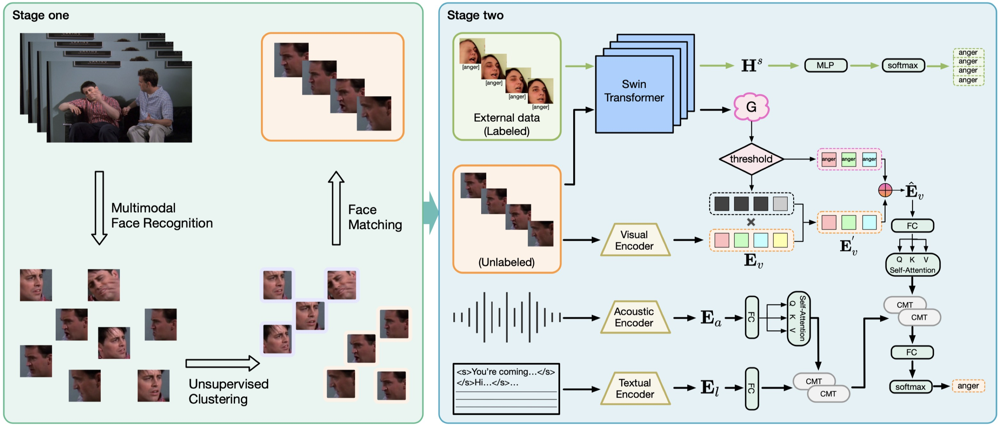

## A Facial Expression-Aware Multimodal Multi-task Learning Framework for Emotion Recognition in Multi-party Conversations

<i>Wenjie Zheng, Jianfei Yu, Rui Xia, and Shijin Wang</i>

<a href=" "></a>
[](https://2023.aclweb.org/)
[](./LICENSE)
</div>

📄 [Paper](https://aclanthology.org/2023.acl-long.861.pdf) | 🎥 [Slides](https://assets.underline.io/lecture/77034/slideshow/632a8d03e3cf76732005efac499155c2.pdf)   

This repository contains the data and code for FacialMMT, a framework that uses facial sequences of real speaker to help multimodal emotion recognition.

[](https://paperswithcode.com/sota/emotion-recognition-in-conversation-on-meld?p=a-facial-expression-aware-multimodal-multi)


- **Facial sequences of real speaker in [MELD](https://affective-meld.github.io/) dataset**: In this part, we will provide the data of extracted real speaker's facial sequences using our first-stage approach. 
- **A multimodal facial expression-aware multi-task learning model**: In this part, we will provide the source code and pre-trained models for ease of both direct evaluation and training from scratch.

***
### Demo :computer:

<p align="center">
  
</p>

***

### Dependencies

Start from building the environment
```
conda create -n FacialMMT python=3.8.15
conda activate FacialMMT
pip install -r requirements.txt
```

Start from the existing environment
```
pip install -r requirements.txt
```

***

### Data and pretrained models preparation

- For ease of reproducibility, you can download the corresponding data and models from the link below and organize it as follows. Afterwards, you should modify the `FacialMMT/preprocess_data/T+A+V/*_facseqs_160_paths_final.json` file to your own path.

Download link: [BaiduNetdisk](https://pan.baidu.com/s/1KRNyPoFf9_WUtrQ6f86IkQ?pwd=iui6), [HuggingFace](https://huggingface.co/NUSTM/FacialMMT)
```
FacialMMT
├── preprocess_data
│   ├── T+A+V
│   │   ├── meld_train_vision_utt.pkl
│   │   ├── meld_val_vision_utt.pkl
│   │   ├── meld_test_vision_utt.pkl
│   │   ├── meld_train_audio_utt.pkl
│   │   ├── meld_val_audio_utt.pkl
│   │   ├── meld_test_audio_utt.pkl
│   │   ├── test_utt_profile.json
│   │   ├── val_utt_profile.json
│   │   ├── train_utt_profile.json
│   │   ├── test_facseqs_160_paths_final.json
│   │   ├── val_facseqs_160_paths_final.json
│   │   ├── train_facseqs_160_paths_final.json 
│   ├── V
│   │   ├── meld_train_vision_utt.pkl
│   │   ├── meld_val_vision_utt.pkl
│   │   ├── meld_test_vision_utt.pkl
├── pretrained_model
│   ├── roberta-large
│   │   ├── xxx
│   │   ├── xxx
│   ├── bert-large
│   │   ├── xxx
│   │   ├── xxx
│   ├── Swin_tiny_Ms-Celeb-1M.pt
│   ├── FacialMMT-unimodal
│   │   ├── unimodal_model_V.pt
│   ├── FacialMMT-RoBERTa
│   │   ├── multimodal_T+A+V_RoBERTa.pt
│   │   ├── best_swin_RoBERTa.pt
│   ├── FacialMMT-BERT
│   │   ├── multimodal_T+A+V_BERT.pt
│   │   ├── best_swin_BERT.pt
```
***

### Evaluating FacialMMT on the test set of MELD
(These results are different from that in our paper because we train the model again)

#### Multimodal Emotion Recognition
you can check our FacialMMT-RoBERTa by running the script below.
```
python main.py --choice_modality T+A+V --plm_name roberta-large --load_multimodal_path FacialMMT-RoBERTa/multimodal_T+A+V_RoBERTa.pt --load_swin_path FacialMMT-RoBERTa/best_swin_RoBERTa.pt --doEval 1
```
you can get the following W-F1 result: `66.73`

To evaluate the performance of FacialMMT-BERT, run the script below.
```
python main.py --choice_modality T+A+V --plm_name bert-large --load_multimodal_path FacialMMT-BERT/multimodal_T+A+V_BERT.pt --load_swin_path FacialMMT-BERT/best_swin_BERT.pt --doEval 1
```
you can get the following W-F1 result: `64.87`

#### Visual Emotion Recognition

Furthermore, we provide a uni-model that uses only the visual modality to evaluate the effectiveness of our own extracted visual data (facial sequences of real speaker).
```
python main.py --choice_modality V --load_unimodal_path FacialMMT-unimodal/unimodal_model_V.pt --doEval 1
```
you can get the following W-F1 result: `36.53`

### Training from scratch
1. First, you need to personally obtain the auxiliary dataset Aff-Wild2. You can find the dataset [here](https://ibug.doc.ic.ac.uk/resources/cvpr-2022-3rd-abaw/).

2. Visual representations at the utterance level need to be obtained. We used [InceptionResNetV1](https://github.com/timesler/facenet-pytorch).

3. Audio representations at the utterance level need to be obtained. We used [wav2vec2.0](https://huggingface.co/facebook/wav2vec2-base-960h).

4. You can run the script below to train the model from scratch.
```
python main.py --choice_modality T+A+V --plm_name roberta-large
```
(We trained on a single 3090Ti with `batch_size=1`. If your hardware allows, we recommend setting a larger batch_size to speed up training.)
***

### Citation

Please consider citing the following if this repo is helpful to your research.
```
@inproceedings{zheng2023facial,
  title={A Facial Expression-Aware Multimodal Multi-task Learning Framework for Emotion Recognition in Multi-party Conversations},
  author={Zheng, Wenjie and Yu, Jianfei and Xia, Rui and Wang, Shijin},
  booktitle={Proceedings of the 61st Annual Meeting of the Association for Computational Linguistics (Volume 1: Long Papers)},
  pages={15445--15459},
  year={2023}
}
```

Please let me know if I can future improve in this repositories or there is anything wrong in our work. You can ask questions via `issues` in Github or contact me via email wjzheng@njust.edu.cn. Thanks for your support!


